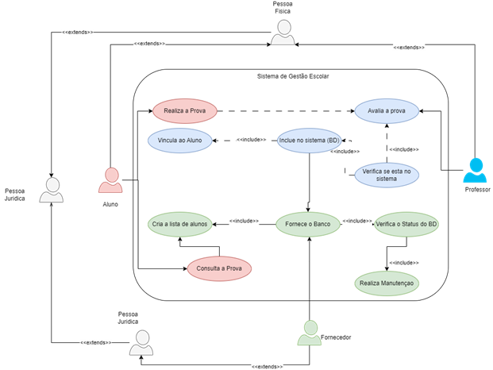
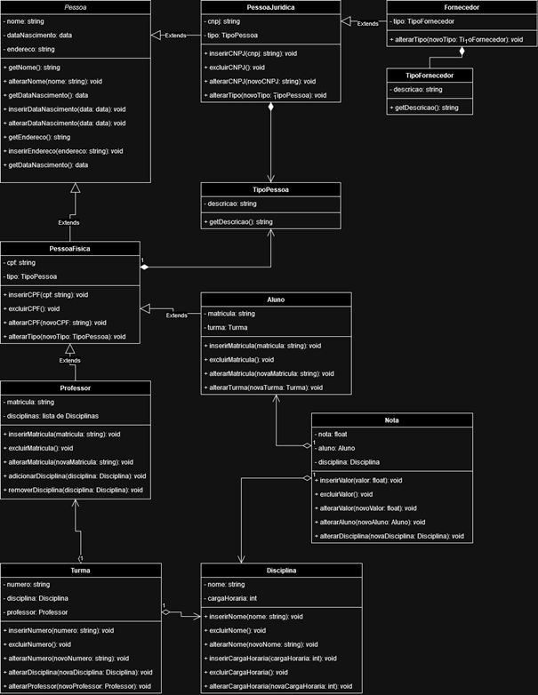

# Projeto Integrador: Processo de Modelagem de Projeto Voltado a Gestão de Dados de um Centro Universitário

**Centro Universitário SENAC - São Paulo 2023**

> **Integrantes:**  
> Darkcikelwe Manoel Neves Ribeiro  
> Júlio Gabriel Moreira Rocha  
> Laura Cristina Angioletto Martins  
> Morgana Conceição da Cruz Gomes  
> Pedro Favoreto Gaya  

## Objetivo

Este projeto integrador dá continuidade aos estudos do curso técnico de Análise e Desenvolvimento de Sistemas, e diz respeito ao desenvolvimento e prática das habilidades de planejamento e modelagem de um projeto de software. Essas habilidades serão aplicadas com o desenvolvimento, em uma primeira etapa, de diagramas de caso de uso e de classe; e em uma segunda etapa por meio da prototipação.

O projeto de software será desenvolvido tendo como modelo um sistema de gerenciamento de uma instituição de ensino, incluindo estruturas como alunos, professores, fornecedores, notas, etc. Deve ser um sistema capaz de lidar com o cadastro de várias pessoas, de tipos diferentes, e que contemplará os vários casos de uso mais comuns a uma instituição de ensino.

A segunda etapa do projeto incluirá o desenvolvimento de um protótipo básico do sistema planejado, de modo a realizar uma conexão entre os diagramas criados na etapa 1 com um sistema similar à realidade. O projeto será, finalmente, incluido em um repositório do GitHub, para que todos os integrantes possam contribuir para o seu desenvolvimento.

## Tecnologias Utilizadas

- Java
- SpringBoot
- Draw.io
- Figma

## Estrutura

O documento com o detalhamento do projeto pode ser encontrado na pasta raiz: **Projeto Integrador - Grupo 10.docx**

Os diagramas de caso de uso e de classe estão localizados na pasta **diagramas/**

As entidades desenvolvidas para o backend SpringBoot estão na pasta: **src/main/java/br/com/senac/projetointegrador/domain/entity/**

## Casos de Uso

  
Cenário: Realiza a Prova

  **Atores:** Aluno, Fornecedor, Professor  

  **Objetivo:** Garantir que o aluno matriculado seja capaz de realizar as avaliações propostas pela faculdade dentro do ambiente de avaliações.  

  **Pré-Condição:** O aluno deve estar matriculado na rede universitária. O aluno deve ter provas agendadas das disciplinas que está matriculado.  

  > **Fluxo Principal:**  
  > 1. O aluno acessa o ambiente de avaliações do portal da faculdade.
  > 2. O aluno realiza a prova.
  > 3. A prova é armazenada por um banco de dados externo através de um fornecedor terceirizado.
  > 4. O fornecedor armazena a prova do aluno.
  > 5. O fornecedor provê uma chave de acesso ao professor.

  > **Fluxos Alternativos:**
  > - Aluno não matriculado:
  >   - Um aviso é exibido que o aluno não se encontra matriculado na instituição.
  > - Aluno sem provas agendadas:
  >   - Um aviso é exibido que o aluno não possui provas agendadas para realização.  

  **Pós-Condição:** Todos os dados são computados por intermédio do fornecedor, de modo que o aluno e o professor tenham acesso aos resultados das avaliações.

  
Cenário: Avalia a Prova

  **Atores:** Professor, Fornecedor  

  **Objetivo:** Garantir que o professor tenha acesso às provas realizadas pelos alunos, e que possa atribuir uma nota às mesmas.

  **Pré-Condição:** O Professor deve ter acesso ao ambiente de avaliações com permissões adicionais. O Professor deve estar vinculado a uma das disciplinas com provas já realizadas.

  > **Fluxo Principal:**  
  > 1. O professor acessa o ambiente de avaliações do portal da faculdade.
  > 2. O professor acessa o arquivo da prova realizada pelo aluno.
  > 3. O professor avalia a prova e realiza um novo envio ao banco de dados com a nota do aluno.
  > 4. Os dados enviados pelo professor são armazenados pelo banco de dados.
  > 5. O fornecedor libera acesso ao aluno para fins de consulta.

  > **Fluxos Alternativos:**
  > - Usuário sem permissões de Professor tenta acessar a sessão para professores:
  >   - Um aviso é exibido que a sessão é exclusiva para professores.
  >   - O usuário é redirecionado para a tela inicial.
  > - Professor sem provas a serem avaliadas:
  >   - Um aviso é exibido que não existem provas que precisam ser avaliadas.

  **Pós-Condição:** As notas das avaliações são salvas no banco de dados e disponibilizadas para a consulta de cada aluno.

  
Cenário: Consulta a Prova

  **Atores:** Aluno

  **Objetivo:** Permitir que os alunos consultem as notas obtidas nas provas, para que possam decidir se precisam ou não realizar a prova de recuperação.

  **Pré-Condição:** O aluno deve estar matriculado na rede universitária. O aluno deve ter realizado uma prova. O professor deve já ter avaliado a prova realizada pelo aluno.

  > **Fluxo Principal:**  
  > 1. O aluno acessa o ambiente de avaliações do portal da universidade.
  > 2. O aluno obtém os resultados da avaliação.

  > **Fluxos Alternativos:**
  > - Aluno sem provas realizadas:
  >   - Um aviso é exibido que não existem provas realizadas pelo aluno.
  > - Prova sem avaliação do professor:
  >   - Um aviso é exibido que a prova ainda não foi realizada pelo professor da disciplina.
  >   - O aluno é informado sobre a data limite até a qual o professor deve ter avaliado a prova.

  **Pós-Condição:** O aluno tem acesso a sua nota obtida na prova. A conta do aluno é atualizada para incluir sua nova nota na média da disciplina.

  
Cenário: Matrícula do Aluno

  **Atores:** Aluno, Fornecedor

  **Objetivo:** Permitir que novos alunos sejam matriculados e tenham acesso às disciplinas e avaliações.

  **Pré-Condição:** Pessoa física. Período de matrículas aberto.

  > **Fluxo Principal:**  
  > 1. A pessoa física acessa o portal da faculdade.
  > 2. Preenche os campos do formulário de acordo com o dado necessário.
  > 3. Assina os termos de compromisso.
  > 4. Realiza o pagamento da matrícula.
  > 5. Os dados são computados pelo sistema da faculdade.
  > 6. Os dados são armazenados no banco de dados do fornecedor.
  > 7. O fornecedor libera o acesso ao aluno.

  > **Fluxos Alternativos:**
  > - Pessoa jurídica tenta realizar matrícula:
  >   - Um aviso é exibido que somente pessoas físicas podem realizar a matrícula.
  > - Pagamento recusado:
  >   - Um aviso é exibido que a forma de pagamento escolhida não pôde ser completada.
  >   - Outras opções de pagamento são exibidas ao usuário.
  
  **Pós-Condição:** O aluno é matriculado e obtém acesso ao ambiente de avaliações.

  
Cenário: Realizar prova de recuperação

  **Atores:** Aluno, Professor, Fornecedor

  **Objetivo:** Garantir que o aluno tenha a possibilidade de realizar uma nova prova caso sua média seja insuficiente para a aprovação.

  **Pré-Condição:** Aluno matriculado na disciplina. Realização das provas regulares. Média do aluno insuficiente para aprovação.

  > **Fluxo Principal:**  
  > 1. O sistema da faculdade informa ao aluno que a média é insuficiente.
  > 2. O professor envia o arquivo da prova de recuperação para o sistema da faculdade.
  > 3. O sistema armazena a prova no banco de dados do fornecedor.
  > 4. O fornecedor disponibiliza uma chave de acesso ao aluno.
  > 5. O aluno acessa o ambiente de avaliações.
  > 6. O aluno realiza a prova.

  > **Fluxos Alternativos:**
  > - Aluno não realizou as provas regulares:
  >   - Um aviso é exibido que somente alunos que realizaram as provas regulares têm direito à prova de recuperação.
  > - Aluno já realizou a prova de recuperação para essa disciplina:
  >   - Um aviso é exibido que somente uma prova de recuperação pode ser realizada por disciplina por semestre.
  
  **Pós-Condição 1:** A pontuação na prova é atingida e o aluno é aprovado.

  **Pós-Condição 2:** A pontuação não é atingida e o aluno é reprovado.

## Diagrama de Classes

